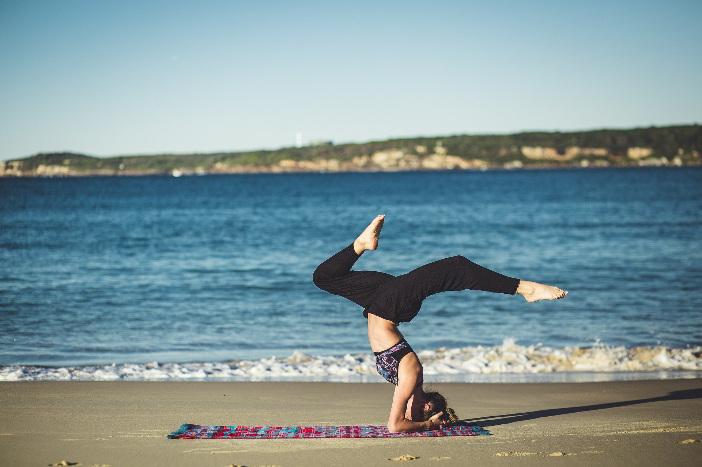
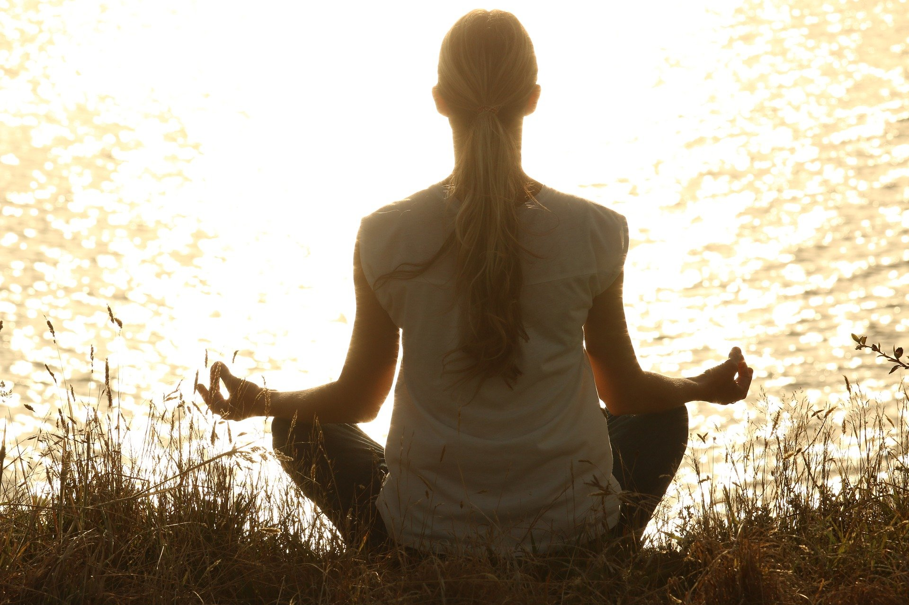

## Yoga basics

The building blocks of a yoga class are a series of specific movements, called poses, coupled with specific breathing techniques and concepts of meditation. There are combinations and changes that can be made to assist students if a pose causes discomfort or proves too hard. Props such as bricks, blankets and straps can be used to help you get the most advantage from the poses, including chairs. Yoga is not one-size-fits-all: Depending on your individual needs and objectives, the best yoga workout for you will depend.

---

## Meditation and Yoga

It was, for thousands of years, predominantly a meditation activity, before yoga was a common physical exercise.Breathing exercises are an important component of yoga, not only helping you remain focused when practicing yoga, but also helping to relieve tension and relax the nervous system and calm the mind.

!

